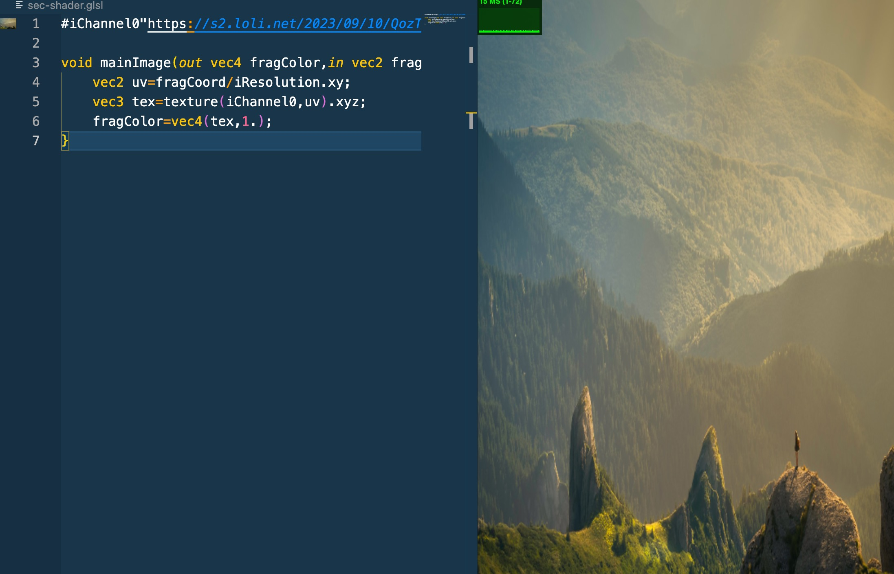
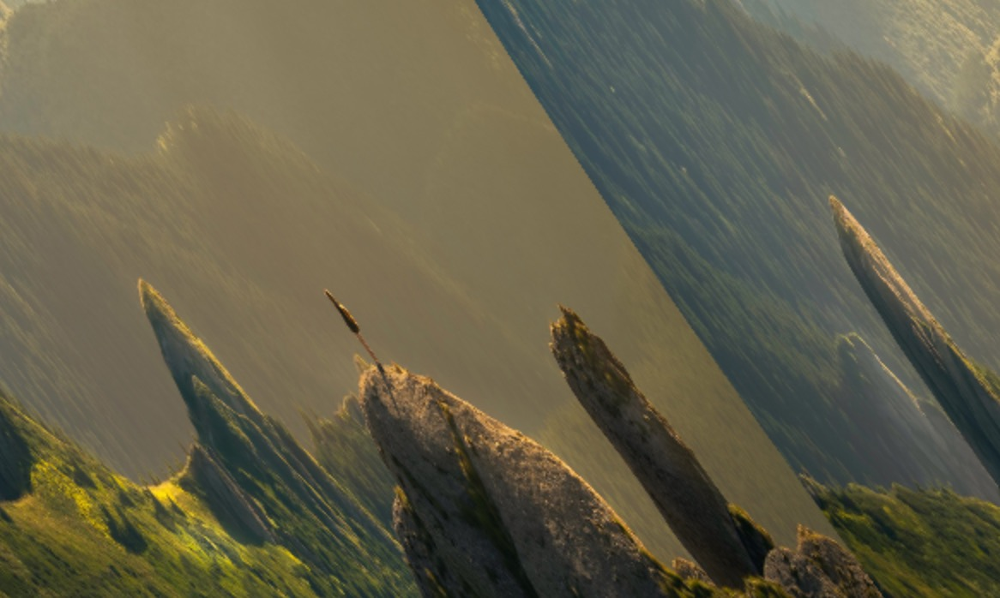

# Shader界的重量级角色 纹理
在`HTML`中，除了用的最多的`div`标签外，最常用的标签应该是`img`。

而在`Shader`里，没有`img`标签，而是换成了**纹理**。

## 启动模版
新建一个`.glsl`文件，并初始化代码
```glsl
void mainImage(out vec4 fragColor,in vec2 fragCoord){
    vec2 uv=fragCoord/iResolution.xy;
    fragColor=vec4(uv,0.,1.);
}
```

## 引入纹理
为了引入纹理，需要处理纹理的`URL`链接，这里提供一张图片的图片链接 :

[我是用于引入纹理的图片链接](https://s2.loli.net/2023/09/10/QozT59R6KsYmb3q.jpg)

它长成这个样子：


如果在`GLSL`文件内编写Shader，那么需要这么引入纹理

```glsl
#iChannel "https://s2.loli.net/2023/09/10/QozT59R6KsYmb3q.jpg"
```
引入纹理后，为了将它显示在屏幕上，需要对它进行采样操作。`GLSL`内置了一个采样函数`texture`，可以直接用它将纹理给采样出来。
```glsl
#iChannel0"https://s2.loli.net/2023/09/10/QozT59R6KsYmb3q.jpg"

void mainImage(out vec4 fragColor,in vec2 fragCoord){
    vec2 uv=fragCoord/iResolution.xy;
    vec3 tex = texture(iChannel0,uv).xyz;
    fragColor=vec4(tex,1.);
}
```
采样函数`texture`接受2个参数：第一个是纹理`iChannel0`，第二个是uv坐标，并且取它的前3维度（暂不考虑纹理的透明度），最后用变量`vec4(tex,1.)`输出到屏幕上。

最后可以看到这个结果：


将纹理渲染到屏幕上后，就可以进行一些操作了～😘

## 扭曲
第一个操作是扭曲，通过改变纹理的uv坐标可以扭曲整个图片的形状。

这时，创建一个叫`distort`的扭曲函数。给扭曲函数内的uv坐标的`x`分量加上`sin`函数处理过的`y`分量。

```glsl
vec2 distort(vec2 p){
    p.x+=sin(p.y);
    return p;
}
```
可以看到图片被极其夸张地扭曲形状了，扭曲程度过大，需要对扭曲量进行调整。


### 调试函数
这里推荐一个网站 ———— [Graphtoy](https://graphtoy.com/),它也是`iq`创建的，用它能很方便地对`Shader`的函数进行可视化调试。

:50.png)

现在调试扭曲函数如下代码：
```glsl
vec2 distort(vec2 p){
    p.x += sin(p.y*10.+iTime)/50.;
    return p;
}
```
目前的扭曲由于加入了`iTime`,可以看到图片正在动态的扭曲。

## 转场
转场意味着，可以将一张纹理转变成另一张纹理。

这里需要[第二张图片](https://s2.loli.net/2023/09/10/Jb8mIhZMBElPiuC.jpg)，这里直接提供。

它长这个样子：


同理，需要在`GLSL`的上方加入这样的代码
```glsl
#iChannel1 "https://s2.loli.net/2023/09/10/Jb8mIhZMBElPiuC.jpg"
```
两张纹理都引入后,也需要创建两个采样函数，用于将2个纹理都采样出来。

```glsl
vec4 getFromColor(vec2 uv){
    return texture(iChannel0,uv);
}

vec4 getToColor(vec2 uv){
    return texture(iChannel1,uv);
}
```
然后可以得到一个转场函数`transition`
```glsl
vec4 transition(vec2 uv){
    float progress=iMouse.x/iResolution.x;
    return mix(getFromColor(uv),getToColor(uv),progress);
}
```
转场函数将2张纹理通过`mix`函数混合了起来，并且混合程度是用户鼠标归一化的`x`轴位置。

在主函数`mainImage`中调用转场函数。
```glsl
void mainImage(out vec4 fragColor,in vec2 fragCoord){
    vec2 uv=fragCoord/iResolution.xy;
    vec4 col=transition(uv);
    fragColor=col;
}
```
左右拖拽鼠标，就能看到最基本的转场

### 滑动转场
使用`step`函数，可以实现滑动转场
```glsl
vec4 transition(vec2 uv){
    float progress=iMouse.x/iResolution.x;
    return mix(getFromColor(uv),getToColor(uv),1.-step(progress,uv.x));
}
```
将画布分为2个部分，位于鼠标左边的部分和位于鼠标右边的部分，左半部分的`uv.x`是小于`progress`的，`step`函数会返回0，混合程度则返回1，表示第二张图；右半部分的`uv.x`是大于`progress`的，`step`函数会返回1，混合程度则返回0，表示第一张图片。

### 遮罩转场
在`progress`变量1的下方新增一个`ratio`变量，表示画布的比例。
```glsl
float ratio = iResolution.x/iResolution.y;
```
这里需要使用到使用到之前的圆形`SDF`函数，将其复制过来
```glsl
// 圆形sdf
float sdfCircle(vec2 p,float r)
{
    return length(p)-r;
}
```
在转场函数中，用上一章所学的知识画一个圆形的遮罩，半径取`progress`，不够大的话乘上一个数(根号2)，然后将这个遮罩取反`1.-c`作为混合程度。
```glsl
vec4 transition(vec2 uv){
    float progress=iMouse.x/iResolution.x;
    float ratio=iResolution.x/iResolution.y;
    
    vec2 p=uv;
    p-=.5;
    p.x*=ratio;
    float d=sdfCircle(p,progress*sqrt(2.));
    float c=smoothstep(0.,.02,d);
    return mix(getFromColor(uv),getToColor(uv),1.-c);
}

void mainImage(out vec4 fragColor,in vec2 fragCoord){
    vec2 uv=fragCoord/iResolution.xy;
    vec4 col=transition(uv);
    fragColor=col;
}
```
拖动鼠标位置，即可看到转场效果。

### 置换转场
除了可以用纹理本身来扭曲纹理的uv坐标，这样的操作称为“置换”，用来扭曲的纹理称为“置换纹理”

先要找到一张“置换纹理”，通常一般是在[3d textures](https://3dtextures.me/)上找到的，选用一张[沙砾的纹理](https://3dtextures.me/2022/04/27/gravel-001/)，然后在下面的Shader中引入它。


## 更多效果
如果想要拥有更多的转场特效，推荐使用`GitHub`上的这个库[gl-transitions](https://github.com/gl-transitions/gl-transitions)

```glsl
vec4 transition(vec2 uv){
    float progress=iMouse.x/iResolution.x;
    float ratio=iResolution.x/iResolution.y;
    
    vec2 dispVec=texture(iChannel2,uv).xy;
    vec2 uv1=vec2(uv.x-dispVec.x*progress,uv.y);
    vec2 uv2=vec2(uv.x+dispVec.x*(1.-progress),uv.y);
    return mix(getFromColor(uv1),getToColor(uv2),progress);
}

void mainImage(out vec4 fragColor,in vec2 fragCoord){
    vec2 uv=fragCoord/iResolution.xy;
    vec4 col=transition(uv);
    fragColor=col;
}
```
将置换纹理采样成`dispVec`，提取2个维度`xy`

对于第一张图片，以原uv为基础，创建新的uv变量`uv1`，在上一章中说过，往正方向（右边）移动的话并非加上，而是减去，因此给uv的`x`坐标减去`x`轴上的偏移量`dispVec.x`，并给它乘上`progress`，让它随鼠标的位置变化而变化的，第二张图片同理也是这么操作的，只不过要把方向取反，并且鼠标位置也要取反，变成`1.-progress`。最后将`getFromColor`和`getToColor`的参数分别设置成新的uv坐标。