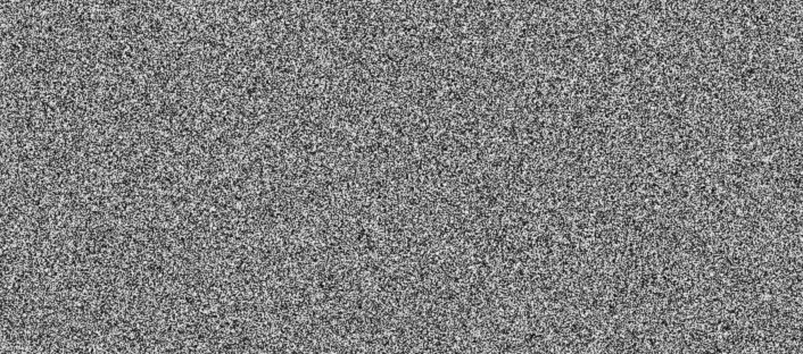
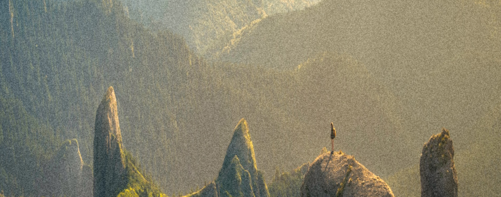
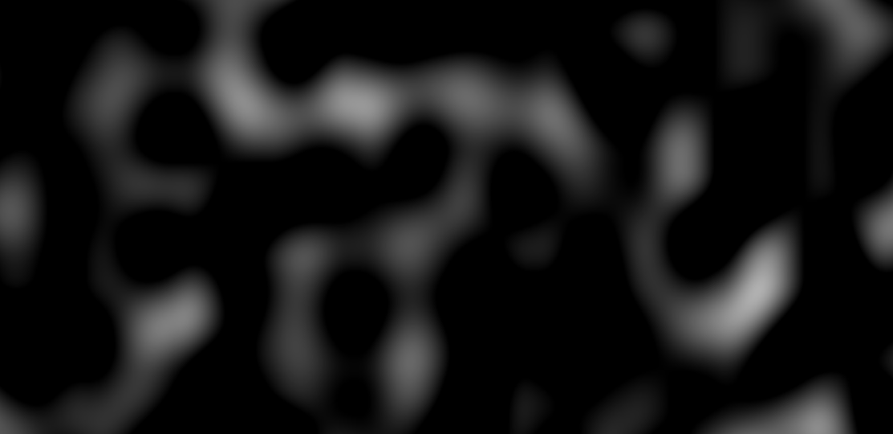
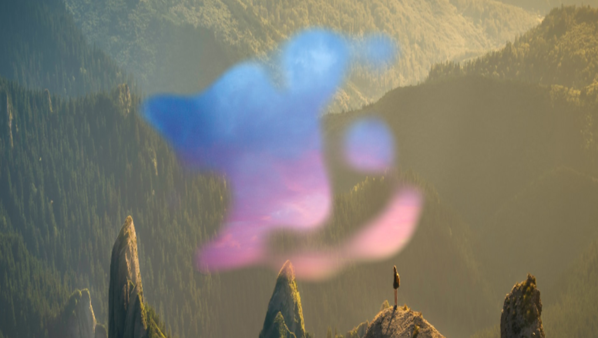
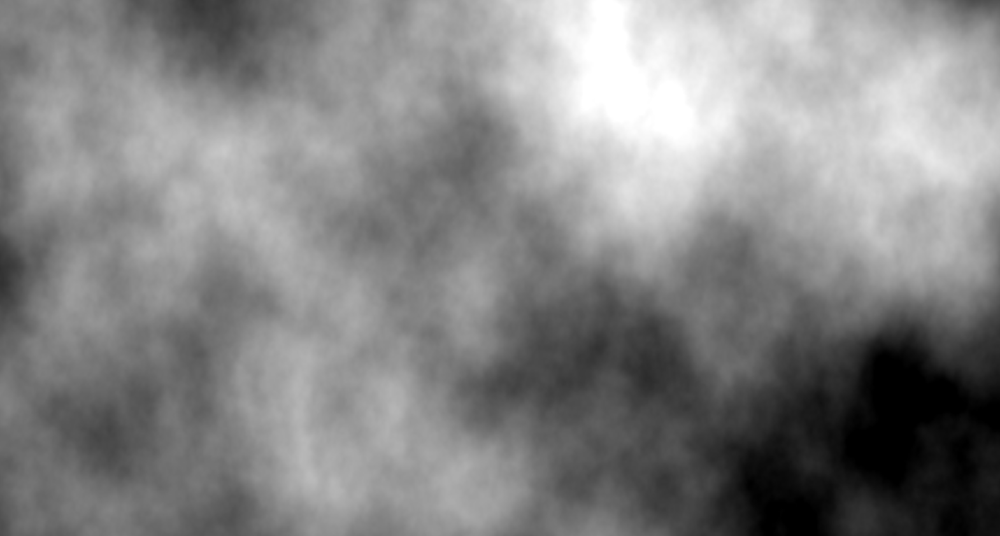

# 随机与噪声
之前绘制的大部分图案都是有序的，规律的，但其实现实的大部分景象都是无序和混乱的。

由于Shader是和数学紧密相关的，而在数学中，跟无序与混沌最接近的一个概念就是**随机**。

## 启动模版
新建一个`.glsl`文件，初始化代码如下：
```glsl
void mainImage(out vec4 fragColor,in vec2 fragCoord){
    vec2 uv=fragCoord/iResolution.xy;
    fragColor=vec4(uv,0.,1.);
}
```
## 随机函数
在`JS`中，可以有内置的随机函数`Math.random`来模拟随机，但是`GLSL`却没有内置的随机函数可以使用，但是在`GitHub`上，已经有人封装好了随机函数[glsl-random](https://github.com/mattdesl/glsl-random)，来看看长什么样子：

```glsl
highp float random(vec2 co)
{
    highp float a=12.9898;
    highp float b=78.233;
    highp float c=43758.5453;
    highp float dt=dot(co.xy,vec2(a,b));
    highp float sn=mod(dt,3.14);
    return fract(sin(sn)*c);
}
```
这个随机函数的意义是取`sin`函数偏后面的小数部分来模拟随机的效果，传入uv坐标，可以得出一个雪花图结果。



## 颗粒化滤镜
如果将这些噪点与纹理叠加在一起，就会得到一种老相片的滤镜的感觉～

完整代码如下：
```glsl
#iChannel0"https://s2.loli.net/2023/09/10/QozT59R6KsYmb3q.jpg"

highp float random(vec2 co)
{
    highp float a=12.9898;
    highp float b=78.233;
    highp float c=43758.5453;
    highp float dt=dot(co.xy,vec2(a,b));
    highp float sn=mod(dt,3.14);
    return fract(sin(sn)*c);
}

void mainImage(out vec4 fragColor,in vec2 fragCoord){
    vec2 uv=fragCoord/iResolution.xy;
    
    float noise=random(uv);
    
    vec3 col=texture(iChannel0,uv).xyz;
    col+=noise*.2;
    fragColor=vec4(col,1.);
}
```



## 噪声
噪声也是实现“随机”的一种手段，只不过它能使实现的效果更佳偏“自然”一些。

平时生活中看到的一些云雾，岩石，火焰等，都是存在噪声的。

同样，和缺少的内置函数一样，`GLSL`里同样也没有内置的噪声函数。但是`GitHub`上，也有封装好的噪声函数[glsl-noise](https://github.com/hughsk/glsl-noise)。

这里选择其中比较常用的柏林噪声`Perlin Noise`的`3d`版本，可以查看它是什么样子的。

```glsl
//
// GLSL textureless classic 3D noise "cnoise",
// with an RSL-style periodic variant "pnoise".
// Author:  Stefan Gustavson (stefan.gustavson@liu.se)
// Version: 2011-10-11
//
// Many thanks to Ian McEwan of Ashima Arts for the
// ideas for permutation and gradient selection.
//
// Copyright (c) 2011 Stefan Gustavson. All rights reserved.
// Distributed under the MIT license. See LICENSE file.
// https://github.com/ashima/webgl-noise
//

vec3 mod289(vec3 x)
{
    return x-floor(x*(1./289.))*289.;
}

vec4 mod289(vec4 x)
{
    return x-floor(x*(1./289.))*289.;
}

vec4 permute(vec4 x)
{
    return mod289(((x*34.)+1.)*x);
}

vec4 taylorInvSqrt(vec4 r)
{
    return 1.79284291400159-.85373472095314*r;
}

vec3 fade(vec3 t){
    return t*t*t*(t*(t*6.-15.)+10.);
}

// Classic Perlin noise
float cnoise(vec3 P)
{
    vec3 Pi0=floor(P);// Integer part for indexing
    vec3 Pi1=Pi0+vec3(1.);// Integer part + 1
    Pi0=mod289(Pi0);
    Pi1=mod289(Pi1);
    vec3 Pf0=fract(P);// Fractional part for interpolation
    vec3 Pf1=Pf0-vec3(1.);// Fractional part - 1.0
    vec4 ix=vec4(Pi0.x,Pi1.x,Pi0.x,Pi1.x);
    vec4 iy=vec4(Pi0.yy,Pi1.yy);
    vec4 iz0=Pi0.zzzz;
    vec4 iz1=Pi1.zzzz;

    vec4 ixy=permute(permute(ix)+iy);
    vec4 ixy0=permute(ixy+iz0);
    vec4 ixy1=permute(ixy+iz1);

    vec4 gx0=ixy0*(1./7.);
    vec4 gy0=fract(floor(gx0)*(1./7.))-.5;
    gx0=fract(gx0);
    vec4 gz0=vec4(.5)-abs(gx0)-abs(gy0);
    vec4 sz0=step(gz0,vec4(0.));
    gx0-=sz0*(step(0.,gx0)-.5);
    gy0-=sz0*(step(0.,gy0)-.5);

    vec4 gx1=ixy1*(1./7.);
    vec4 gy1=fract(floor(gx1)*(1./7.))-.5;
    gx1=fract(gx1);
    vec4 gz1=vec4(.5)-abs(gx1)-abs(gy1);
    vec4 sz1=step(gz1,vec4(0.));
    gx1-=sz1*(step(0.,gx1)-.5);
    gy1-=sz1*(step(0.,gy1)-.5);

    vec3 g000=vec3(gx0.x,gy0.x,gz0.x);
    vec3 g100=vec3(gx0.y,gy0.y,gz0.y);
    vec3 g010=vec3(gx0.z,gy0.z,gz0.z);
    vec3 g110=vec3(gx0.w,gy0.w,gz0.w);
    vec3 g001=vec3(gx1.x,gy1.x,gz1.x);
    vec3 g101=vec3(gx1.y,gy1.y,gz1.y);
    vec3 g011=vec3(gx1.z,gy1.z,gz1.z);
    vec3 g111=vec3(gx1.w,gy1.w,gz1.w);

    vec4 norm0=taylorInvSqrt(vec4(dot(g000,g000),dot(g010,g010),dot(g100,g100),dot(g110,g110)));
    g000*=norm0.x;
    g010*=norm0.y;
    g100*=norm0.z;
    g110*=norm0.w;
    vec4 norm1=taylorInvSqrt(vec4(dot(g001,g001),dot(g011,g011),dot(g101,g101),dot(g111,g111)));
    g001*=norm1.x;
    g011*=norm1.y;
    g101*=norm1.z;
    g111*=norm1.w;

    float n000=dot(g000,Pf0);
    float n100=dot(g100,vec3(Pf1.x,Pf0.yz));
    float n010=dot(g010,vec3(Pf0.x,Pf1.y,Pf0.z));
    float n110=dot(g110,vec3(Pf1.xy,Pf0.z));
    float n001=dot(g001,vec3(Pf0.xy,Pf1.z));
    float n101=dot(g101,vec3(Pf1.x,Pf0.y,Pf1.z));
    float n011=dot(g011,vec3(Pf0.x,Pf1.yz));
    float n111=dot(g111,Pf1);

    vec3 fade_xyz=fade(Pf0);
    vec4 n_z=mix(vec4(n000,n100,n010,n110),vec4(n001,n101,n011,n111),fade_xyz.z);
    vec2 n_yz=mix(n_z.xy,n_z.zw,fade_xyz.y);
    float n_xyz=mix(n_yz.x,n_yz.y,fade_xyz.x);
    return 2.2*n_xyz;
}
```
传入到uv中，看看输出👀
```glsl
void mainImage(out vec4 fragColor,in vec2 fragCoord){
    vec2 uv=fragCoord/iResolution.xy;
    
    float noise=cnoise(vec3(uv*10.,0.));
    
    vec3 col=vec3(noise);
    fragColor=vec4(col,1.);
}
```
缩放uv坐标10倍之后，可以看到噪声图如下⬇️



## 噪声转场
之前有写过遮罩转场效果，现在可以加上噪声做出更好的效果。加入两张纹理。
```glsl
#iChannel0 "https://s2.loli.net/2023/09/10/QozT59R6KsYmb3q.jpg"
#iChannel1 "https://s2.loli.net/2023/09/10/Jb8mIhZMBElPiuC.jpg"

```

写下如下的代码：
```glsl
vec4 getFromColor(vec2 uv){
    return texture(iChannel0,uv);
}

vec4 getToColor(vec2 uv){
    return texture(iChannel1,uv);
}

float sdfCircle(vec2 p,float r){
    return length(p)-r;
}

vec4 transition(vec2 uv){
    float progress=iMouse.x/iResolution.x;
    float ratio=iResolution.x/iResolution.y;
    
    vec2 p=uv;
    p-=.5;
    p.x*=ratio;
    
    float noise=cnoise(vec3(p*10.,0.));
    float pr=progress+noise*.1;
    
    float d=sdfCircle(p,pr*sqrt(2.4));
    float c=smoothstep(-.1,-.05,d);
    
    return mix(getFromColor(uv),getToColor(uv),1.-c);
}

void mainImage(out vec4 fragColor,in vec2 fragCoord){
    vec2 uv=fragCoord/iResolution.xy;
    
    vec4 col=transition(uv);
    
    fragColor=col;
}
```
可以得到如下的转场效果：


## FBM
`FBM`的全称是`Fractal Brownian Motion`，翻译为**分形布朗运动**，它是将多个具有不同频率和振幅的噪声的结果值相叠加而产生结果的一种随机过程。一般用于构造自然界的云层，山脉，地貌等不规则的形体。

上文中用的是柏林噪声，这里把噪声换成更加自然的`Simplex`噪声，它的具体代码如下：
```glsl
//
// Description : Array and textureless GLSL 2D/3D/4D simplex
//               noise functions.
//      Author : Ian McEwan, Ashima Arts.
//  Maintainer : ijm
//     Lastmod : 20110822 (ijm)
//     License : Copyright (C) 2011 Ashima Arts. All rights reserved.
//               Distributed under the MIT License. See LICENSE file.
//               https://github.com/ashima/webgl-noise
//

vec3 mod289(vec3 x) {
  return x - floor(x * (1.0 / 289.0)) * 289.0;
}

vec4 mod289(vec4 x) {
  return x - floor(x * (1.0 / 289.0)) * 289.0;
}

vec4 permute(vec4 x) {
     return mod289(((x*34.0)+1.0)*x);
}

vec4 taylorInvSqrt(vec4 r)
{
  return 1.79284291400159 - 0.85373472095314 * r;
}

float snoise(vec3 v)
  {
  const vec2  C = vec2(1.0/6.0, 1.0/3.0) ;
  const vec4  D = vec4(0.0, 0.5, 1.0, 2.0);

// First corner
  vec3 i  = floor(v + dot(v, C.yyy) );
  vec3 x0 =   v - i + dot(i, C.xxx) ;

// Other corners
  vec3 g = step(x0.yzx, x0.xyz);
  vec3 l = 1.0 - g;
  vec3 i1 = min( g.xyz, l.zxy );
  vec3 i2 = max( g.xyz, l.zxy );

  //   x0 = x0 - 0.0 + 0.0 * C.xxx;
  //   x1 = x0 - i1  + 1.0 * C.xxx;
  //   x2 = x0 - i2  + 2.0 * C.xxx;
  //   x3 = x0 - 1.0 + 3.0 * C.xxx;
  vec3 x1 = x0 - i1 + C.xxx;
  vec3 x2 = x0 - i2 + C.yyy; // 2.0*C.x = 1/3 = C.y
  vec3 x3 = x0 - D.yyy;      // -1.0+3.0*C.x = -0.5 = -D.y

// Permutations
  i = mod289(i);
  vec4 p = permute( permute( permute(
             i.z + vec4(0.0, i1.z, i2.z, 1.0 ))
           + i.y + vec4(0.0, i1.y, i2.y, 1.0 ))
           + i.x + vec4(0.0, i1.x, i2.x, 1.0 ));

// Gradients: 7x7 points over a square, mapped onto an octahedron.
// The ring size 17*17 = 289 is close to a multiple of 49 (49*6 = 294)
  float n_ = 0.142857142857; // 1.0/7.0
  vec3  ns = n_ * D.wyz - D.xzx;

  vec4 j = p - 49.0 * floor(p * ns.z * ns.z);  //  mod(p,7*7)

  vec4 x_ = floor(j * ns.z);
  vec4 y_ = floor(j - 7.0 * x_ );    // mod(j,N)

  vec4 x = x_ *ns.x + ns.yyyy;
  vec4 y = y_ *ns.x + ns.yyyy;
  vec4 h = 1.0 - abs(x) - abs(y);

  vec4 b0 = vec4( x.xy, y.xy );
  vec4 b1 = vec4( x.zw, y.zw );

  //vec4 s0 = vec4(lessThan(b0,0.0))*2.0 - 1.0;
  //vec4 s1 = vec4(lessThan(b1,0.0))*2.0 - 1.0;
  vec4 s0 = floor(b0)*2.0 + 1.0;
  vec4 s1 = floor(b1)*2.0 + 1.0;
  vec4 sh = -step(h, vec4(0.0));

  vec4 a0 = b0.xzyw + s0.xzyw*sh.xxyy ;
  vec4 a1 = b1.xzyw + s1.xzyw*sh.zzww ;

  vec3 p0 = vec3(a0.xy,h.x);
  vec3 p1 = vec3(a0.zw,h.y);
  vec3 p2 = vec3(a1.xy,h.z);
  vec3 p3 = vec3(a1.zw,h.w);

//Normalise gradients
  vec4 norm = taylorInvSqrt(vec4(dot(p0,p0), dot(p1,p1), dot(p2, p2), dot(p3,p3)));
  p0 *= norm.x;
  p1 *= norm.y;
  p2 *= norm.z;
  p3 *= norm.w;

// Mix final noise value
  vec4 m = max(0.6 - vec4(dot(x0,x0), dot(x1,x1), dot(x2,x2), dot(x3,x3)), 0.0);
  m = m * m;
  return 42.0 * dot( m*m, vec4( dot(p0,x0), dot(p1,x1),
                                dot(p2,x2), dot(p3,x3) ) );
  }

#pragma glslify: export(snoise)
```
然后来实现`fbm`函数：
```glsl
            float fbm(vec3 p){
                float value=0.;
                float amplitude=1.;
                float frequency=1.;
                float lacunarity=2.;
                float persistance=.5;
                float scale=1.;
                int octaves=8;
                
                for(int i=0;i<octaves;i++){
                    float noiseVal=snoise(p*frequency*scale);
                    
                    value+=amplitude*noiseVal;
                    frequency*=lacunarity;
                    amplitude*=persistance;
                }
                
                return value;
            }
```
这里定义了几个变量：`value`代表结果值，`amplitude`代表振幅，`frequency`代表频率，`lacunarity`代表空隙，`persistance`代表持续度，`scale`代表缩放程度，`octaves`代表音度。

然后通过`for`循环来叠加噪声，叠加的次数就是音度，在叠加的同时升高频率，降低振幅。

通过uv来进行观察：
```glsl
            void mainImage(out vec4 fragColor,in vec2 fragCoord){
                vec2 uv=fragCoord/iResolution.xy;
                float noise = fbm(vec3(uv,0.));
                vec3 col = vec3(noise);
                fragColor = vec4(col,1.);
                //fragColor=col;
            }
```
会得到一个云层一般的噪声图案
