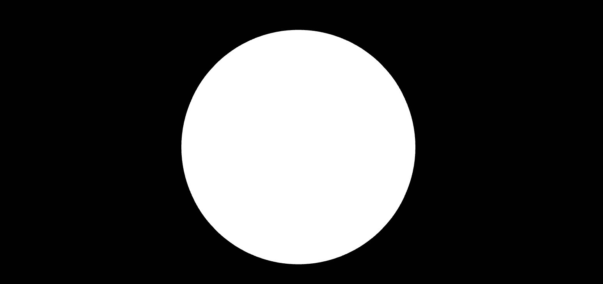
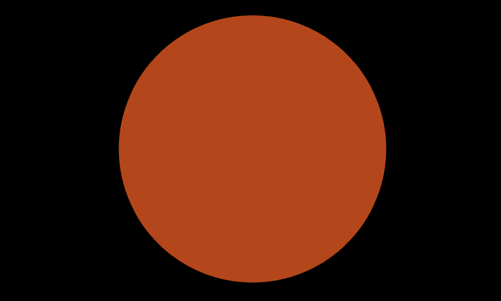

# 顶点着色器
如果收到过巧克力🍫礼盒，可以知道巧克力盒有各种各样的巧克力，它们在颜色，图案，形状上都有所不同：既有白色的，波纹状的，方形的，咖啡色的，条纹状的，圆形的巧克力...

如果说片元着色器决定了一个巧克力的颜色和图案，那么**顶点着色器**就决定了巧克力的形状。

## 3D世界
在学习顶点着色器之前，需要把2d世界转换为3d世界。

这里要引入一个第三方库[kokomi.js](https://github.com/alphardex/kokomi.js)。

这里简单的介绍一下它：`kokomi.js`是一个基于[three.js](https://github.com/mrdoob/three.js)二次封装的`3D`框架，里面封装了很多实用的函数和类，并且支持组件化地编写`3D`物体，可以把它当作是`three.js`界的`jQuery`！

接下来，可以使用`kokomi.js`来搭建一个`3D`世界。

新建一个`kokomi.html`文件，重置浏览器背景色为黑色
```css
    body{
        margin: 0;
        background: black;
    }
```
定义画布的容器标签，设置`id`为`sketch`
```html
<div id="sketch"></div>
```
同时引入`kokomi.js`和`three.js`
```html
    <script src="https://unpkg.com/kokomi.js@1.9.78/build/kokomi.umd.js"></script>
    <script src="https://unpkg.com/three@0.154.0/build/three.min.js"></script>
```
创建一个空白的`3d`画布
```html
    <script>
        class Sketch extends kokomi.Base{
            create(){

            }
        }

        const sketch = new Sketch("#sketch");
        sketch.create()
    </script>
```
`Sketch`所继承的`kokomi.Base`类为开发者自动创建了场景`scene`，渲染器`renderer`，相机`camera`，动画循环以及其他的一些组件，然后在`create`函数里继续编写代码。

现在设置下相机的初始位置，并且引入轨道控制组件`kokomi.OrbitControls`，这个组件使开发者能够通过拖拽鼠标来自由地观察整个场景。
```js
    this.camera.position.set(0,0,5);
    new kokomi.OrbitControls(this);
```
这样就搭建了一个最简单的`3d`画布，里面暂时空空如也。

## 网格
现在可以创建第一个`3d`物体，在`three.js`中，`3D`物体被称作网格`Mesh`，而网格是由两部分组成的：
- 几何体`geometry`：定义了`3D`物体的形状
- 材质`meterial`：定义了`3D`
现在可以试着创建一个白色的球体：
```js
        class Sketch extends kokomi.Base{
            create(){
                this.camera.position.set(0,0,5);
                 new kokomi.OrbitControls(this);

                 const geomotry = new THREE.SphereGeometry(2,64,64);
                 const material = new THREE.MeshBasicMaterial({
                    color:"#ffffff",
                 })

                 const mesh = new THREE.Mesh(geomotry,material);
                 this.scene.add(mesh)
            }
        }

        const sketch = new Sketch("#sketch");
        sketch.create()
```
[SphereGeometry](https://threejs.org/docs/#api/en/geometries/SphereGeometry)指定了几何体为球体，半径为2，宽高的细分皆为64；[MeshBasicMaterial](https://threejs.org/docs/#api/en/materials/MeshBasicMaterial)指定了材质为基础材质（没有光照，只有颜色或纹理的材质），颜色为白色。效果如下：


对于`three.js`，它是一个`webGL`封装程度非常高的框架。刚刚用到的基础材质，包括`three.js`所有的内置材质都是通过Shader来实现的。

尽管`three.js`内置材质本身非常好用，但是也有局限性的，如果想实现一些自定义的效果，只用内置材质是难以实现的。实际上，有一种材质能够完完全全地自定义Shader。

## 自定义Shader
[ShaderMaterial](https://threejs.org/docs/#api/en/materials/ShaderMaterial)**满足了开发者能够自定义顶点着色器和片元着色器**。

将刚刚场景内的球体的材质替换为`ShaderMaterial`。
```js
const material = new THREE.ShaderMaterial()
```
向`THREE.ShaderMaterial`内传入`glsl`代码:
```js
    const material = new THREE.ShaderMaterial(
        {
            vertexShader:`
                void main(){
                    vec4 modelPosition=modelMatrix*vec4(position,1.);
                    vec4 viewPosition=viewMatrix*modelPosition;
                    vec4 projectedPosition=projectionMatrix*viewPosition;
                    gl_Position=projectedPosition;
                }
            `,
            fragmentShader:`
                void main(){
                    vec3 color = vec3(1.,0.,0.);
                    gl_FragColor=vec4(color,1.);
                }
                `
        }
    )
```
效果如下：

`fragmentShader`是**片元着色器**，里面的代码就是之前的Shader代码。（略微的差别是`mainImage`变成了`main`且参数消失了，`fragColor`变成了`gl_FragColor`。）

`vertexShader`是**顶点着色器**，它代表的意思是：一个叫`position`的变量，经过了3个矩阵的变换，被赋给了`gl_Position`，这三个矩阵被称为`MVP`矩阵，分别代表了**模型**，**视图**，**投影**。

具体含义可以参考[从零开始学图形学：MVP Transformation](https://zhuanlan.zhihu.com/p/343532009)

其实，这三个矩阵的其中2个矩阵（模型和视图）可以合并为一个矩阵`modelViewMatrix`，这样就可以把顶点着色器的代码给简化为一行。
```glsl
    void main(){
        gl_Position=projectionMatrix*modelViewMatrix*vec4(position,1.);
    }
```
`MVP`矩阵变换这个操作基本都是固定的，真正需要的变量是`position`，对它可以进行各种操作，将其单独作为一个变量`p`提取出来：
```glsl
    void main(){
        vec3 p = position;
        gl_Position=projectionMatrix*modelViewMatrix*vec4(p,1.);
    }
```

## varying
在前文中，经常提到`UV`，其实，它就存在于顶点着色器中，变量名为`uv`。然而它是一个`attribute`变量，并不是`uniform`，这就意味着它只存在于顶点着色器，而不是在片元着色器内。是否存在一些办法可以将它从一个着色器传递到另一个着色器？

在前文中，有提到过“变量限定符”这个概念，而其中有一种能够在2个着色器之间传递变量，它就是`varying`。

现在顶点着色器顶部声明一个`varying`变量`vUv`
```glsl
varying vec2 vUv;
```
在顶点着色器的`main`函数内部的末尾，将变量`uv`赋给`vUv`
```glsl
void main(){
    ...
    vUv=uv
}
```
在片元着色器中的顶部也声明`vUv`
```glsl
varying vec2 vUv;
```
在片元着色器的`main`函数内，将`vUv`赋给`uv`变量，并且直接输出颜色
```glsl
void main(){
    vec2 uv = vUv;
    gl_FragColor = vec4(uv,0.,1.);
}
```